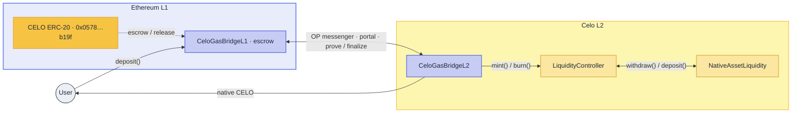
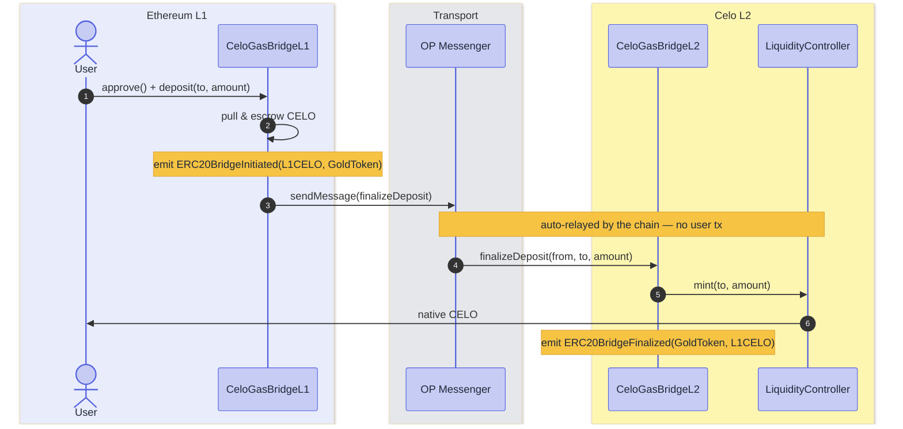
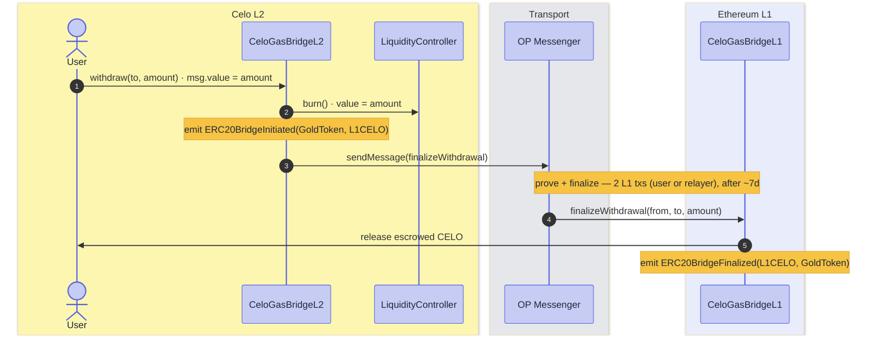

# Celo CGT v2 — Bridge Integration

Integration reference for bridge operators and indexers moving CELO between Ethereum (L1) and the Celo L2 under CGT v2 — the model, addresses, flows, and events to index, with the v1 → v2 changes called out.

## Model

CELO is one asset in two forms — the **native gas token on the Celo L2** and an **ERC-20 on Ethereum** (18 decimals both). The L2 native is canonical; the Ethereum ERC-20 is its 1:1 bridged representation. A dedicated bridge moves CELO between them — CELO only; every other ERC-20 uses the standard `L1StandardBridge` / `L2StandardBridge`.

- **L1** — `CeloGasBridgeL1` holds the ERC-20 in escrow.
- **L2** — `CeloGasBridgeL2` moves native CELO in and out of a reserve (`NativeAssetLiquidity`) via `LiquidityController`. **GoldToken** is the ERC-20 *view* of that native CELO — same balance as `eth_getBalance`.

Bridging to Ethereum locks native CELO in the L2 reserve and frees an ERC-20; bridging back reverses it.

## Architecture

CELO is escrowed on L1 and exists as native gas on L2; the bridge keeps the two sides 1:1.



## Addresses

Ethereum (chainId `1`) ↔ Celo (`42220`).

**Ethereum (L1)**

| Contract | Address |
|---|---|
| CELO (ERC-20, 18 dp) | `0x057898f3C43F129a17517B9056D23851F124b19f` |
| `CeloGasBridgeL1` | per-deployment proxy — see the Celo chain registry |

**Celo (L2)** — fixed predeploys

| Contract | Address |
|---|---|
| `CeloGasBridgeL2` | `0x4200000000000000000000000000000000001023` |
| GoldToken (CELO ERC-20 view, 18 dp) | `0x471EcE3750Da237f93B8E339c536989b8978a438` |
| `LiquidityController` | `0x420000000000000000000000000000000000002A` |
| `NativeAssetLiquidity` | `0x4200000000000000000000000000000000000029` |

## What changed: v1 → v2

v1 pushed CELO through the OptimismPortal, so the only on-chain trace was the portal's low-level, opaque events. v2 adds a dedicated bridge that emits standard `ERC20Bridge*` events with an explicit `(localToken, remoteToken)` pair — directly indexable as a CELO transfer.

### Deposit (L1 → L2)

| Step | v1 | v2 |
|---|---|---|
| 1 · Initiate (L1) · user | `OptimismPortal2.depositERC20Transaction()` | `CeloGasBridgeL1.deposit()` |
| 2 · Finalize (L2) · auto | deposit tx mints native | `CeloGasBridgeL2.finalizeDeposit()` → `LiquidityController.mint()` |
| L1 CELO held by | `OptimismPortal2` | `CeloGasBridgeL1` |
| Events | `TransactionDeposited` | `ERC20BridgeInitiated` (L1), `ERC20BridgeFinalized` (L2) |

### Withdraw (L2 → L1)

| Step | v1 | v2 |
|---|---|---|
| 1 · Initiate (L2) · user | `L2ToL1MessagePasser.initiateWithdrawal()` | `CeloGasBridgeL2.withdraw()` → `LiquidityController.burn()` (locks native in reserve) |
| 2 · Prove (L1) · user / relayer | `OptimismPortal2.proveWithdrawalTransaction()` | unchanged |
| 3 · Finalize (L1) · user / relayer | `OptimismPortal2.finalizeWithdrawalTransaction()` | `OptimismPortal2.finalizeWithdrawalTransaction()` → `CeloGasBridgeL1.finalizeWithdrawal()` *(auto)* |
| L1 CELO held by | `OptimismPortal2` | `CeloGasBridgeL1` |
| Events | `MessagePassed`, `WithdrawalProven`, `WithdrawalFinalized` | the same + `ERC20BridgeInitiated` (L2), `ERC20BridgeFinalized` (L1) |

Prove + finalize are two permissionless L1 transactions — the user or a relayer submits them — and clear only after the dispute-game + proof-maturity window (~7 days on mainnet); the bridge's `finalizeWithdrawal` then runs automatically.

## Deposit flow (L1 → L2)

**User calls** `approve()` then `CeloGasBridgeL1.deposit(address to, uint256 amount, uint32 minGasLimit, bytes extraData)` — that's it. CELO is escrowed on L1, then credited as native CELO to `to` on L2 automatically (no L2 transaction from the user). (`amount` in wei; `minGasLimit` is L2 execution gas, e.g. `200000`.)



```js
await celo.approve(bridgeL1, amount); // celo = L1 CELO ERC-20; amount in wei (18 dp)
await bridgeL1.deposit(to, amount, 200_000n, "0x"); // bridgeL1 = CeloGasBridgeL1 proxy — done; L2 credit is automatic
```

## Withdraw flow (L2 → L1)

**User calls** `CeloGasBridgeL2.withdraw(address to, uint256 amount, uint32 minGasLimit, bytes extraData)` with `msg.value == amount`; then, after the ~7-day window, `proveWithdrawalTransaction()` + `finalizeWithdrawalTransaction()` on `OptimismPortal2` — or let a bridge/relayer submit those two. Native CELO is locked in the L2 reserve; the bridge's `finalizeWithdrawal` then releases CELO to `to` on L1 automatically.



```js
import { publicActionsL1, publicActionsL2, walletActionsL1, getWithdrawals } from "viem/op-stack";
const l1 = walletClientL1.extend(publicActionsL1()).extend(walletActionsL1());
const l2 = publicClientL2.extend(publicActionsL2());

// 1 · Initiate on L2 (bridgeL2 = 0x4200000000000000000000000000000000001023)
const tx = await bridgeL2.withdraw(to, amount, 200_000n, "0x", { value: amount });
const receipt = await l2.getTransactionReceipt({ hash: tx.hash });
const [withdrawal] = getWithdrawals(receipt);

// 2 · Prove on L1 (once the L2 state root is posted)
const { output, withdrawal: w } = await l1.waitToProve({ receipt, targetChain: l2.chain });
await l1.proveWithdrawal(await l2.buildProveWithdrawal({ output, withdrawal: w }));

// 3 · Finalize on L1 (after the ~7-day challenge window)
await l1.waitToFinalize({ withdrawalHash: withdrawal.withdrawalHash, targetChain: l2.chain });
await l1.finalizeWithdrawal({ targetChain: l2.chain, withdrawal });
```

## Events to index

Standard OP `StandardBridge` signatures (identical topic-0 to upstream):

```solidity
event ERC20BridgeInitiated(
    address indexed localToken,
    address indexed remoteToken,
    address indexed from,
    address to,
    uint256 amount,
    bytes extraData
);
event ERC20BridgeFinalized(
    address indexed localToken,
    address indexed remoteToken,
    address indexed from,
    address to,
    uint256 amount,
    bytes extraData
);
```

| Event | `topic0` |
|---|---|
| `ERC20BridgeInitiated` | `0x7ff126db8024424bbfd9826e8ab82ff59136289ea440b04b39a0df1b03b9cabf` |
| `ERC20BridgeFinalized` | `0xd59c65b35445225835c83f50b6ede06a7be047d22e357073e250d9af537518cd` |

`localToken` = token on the emitting chain; `remoteToken` = its counterpart. For CELO: L1 = `0x0578…b19f`, L2 = GoldToken `0x471E…a438`.

**Correlation** — the pair mirrors across domains. Join a deposit's (or withdrawal's) two legs on `(localToken, remoteToken, from, to, amount)`; all pass through unchanged, with `extraData` forwarded verbatim:

| Leg | Initiated (source) | Finalized (dest) |
|---|---|---|
| Deposit | L1 `(L1CELO, GoldToken)` | L2 `(GoldToken, L1CELO)` |
| Withdraw | L2 `(GoldToken, L1CELO)` | L1 `(L1CELO, GoldToken)` |

So `Initiated.localToken == Finalized.remoteToken`, and vice versa.

## Integration notes

- **Indexing** — index the `ERC20Bridge*` events for token accounting. v2 rides the OP messenger/portal, so low-level `TransactionDeposited` / `Withdrawal*` events also appear; ignore them for token flow. Index L1 events at the user's usual confirmation depth.
- **Withdrawal finality** — completes only after the OP prove + finalize window (configurable per chain; ~7 days on mainnet); the L1 `ERC20BridgeFinalized` is the done signal.
- **Backing** — native CELO on L2 is canonical; the L1 CELO ERC-20 is a bridged representation. Each CELO bridged to Ethereum locks the matching native CELO in the L2 `NativeAssetLiquidity` reserve (released on the way back), so circulating L1 CELO is collateralized 1:1; `CeloGasBridgeL1` also stays solvent — tracked escrow ≤ its CELO balance.
- **Disabled paths** — the portal value path reverts in CGT mode (`OptimismPortal_NotAllowedOnCGTMode`); the inherited `bridgeERC20*` / `bridgeETH*` entrypoints revert (`CeloGasBridge*_Disabled`). Use `deposit` / `withdraw`.
- **L2 mint/burn internals** — minting pulls native from the pool (`LiquidityController.mint` → `NativeAssetLiquidity.withdraw`), burning returns it (`LiquidityController.burn` → `NativeAssetLiquidity.deposit`). The verbs are named from the pool's side.
- Emits only `ERC20BridgeInitiated` / `ERC20BridgeFinalized` — never the legacy `ETHBridge*` or `ERC20Deposit*` events.
